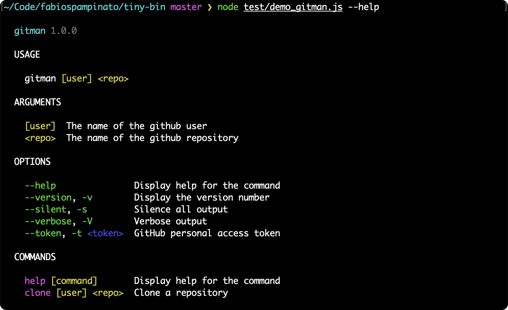

<p align="center">
  
</p>

# Tiny Bin

A library for building tiny and beautiful command line apps.

## Features

At a high level this package provides:

- A tiny library, that has no third-party dependencies, that can be bundled, for great startup performance.
- Beautiful colored and detailed help pages. Colors can be turned off also.
- Automatic update notifications, that will notify the user of an update right before exiting.
- Automatic package name and version detection, so you don't even need to provide those.
- Automatic typo detection, it will suggest the closest command/option if you mistype one.
- Automatic `help` and `--help` handling, both for the bin and for each command.
- Automatic `--version` and `-v` handling.
- Automatic `--no-color` and `--no-colors` handling.

This library has 5 primitives, bins, commands, options, arguments and actions:

- Bin:
  - A bin is the entry point of your command line app, you can define multiple bins.
  - Each bin has a name, a description, and a few built-in commands (default, help, version).
  - Each bin can have multiple custom commands.
  - The action for the default command is customizable.
- Command:
  - A command is the function that will be executed when running your bin.
  - Each command has a name, a description, and an automatically generated usage example.
  - Each command can optional have a section, which will be used to group commands in the help page.
  - Each command can optionally be hidden from the help page.
  - Each command can optionally have custom usage examples.
  - Each command can have multiple options.
  - Each command can have multiple arguments.
  - Each command has an action, which is your actual function that will called by the command.
- Option:
  - An option is a flag that can be passed to your command.
  - Each option has a name, a description, and an implicit type (boolean or string).
  - Each option can optional have a section, which will be used to group options in the help page.
  - Each option can optionally be hidden from the help page.
  - Each option can optionally be marked as deprecated, causing it to be dimmed in the help page.
  - Each option can optionally be marked as eager, so it will consume multiple consecutive values.
  - Each option can optionally be marked as incompatible with some others.
  - Each option can optionally be marked as required, so the library will error if it's not provided.
  - Each option can optionally be marked as explicitly overriding a previously defined option.
  - Each option can optionally have a default value.
  - Each option can optionally have an explicit list of allowed values.
  - Each option can have multiple longhands (e.g. `--foo`) and multiple shorthands (e.g. `-f`).
  - Each provided longhand and shorthand for an option is automatically aliased to all the others.
  - Each non-boolean option must receive at least one value.
  - Each variadic option can receive multiple values (e.g. `<values...>`).
- Argument:
  - An argument is a value that can be passed to your command.
  - Each argument has a name and a description.
  - Each argument can be marked as required, so the library will error if it's not provided.
  - Each variadic argument (e.g. `<args...>`) can receive multiple values.
- Action:
  - An action is the function that will be called when running your command.
  - It will receive the following arguments:
    - The options object, containing all options for which the library has a value.
    - The arguments array, contaning an array of strings passed to your command.
    - The passthrough arguments array, containing an array of strings passed to your command after the special `--` separator.

## Install

```sh
npm install --save tiny-bin
```

## Usage

```ts
import bin from 'tiny-bin';

bin ( 'gitman', 'A simple yet powerful opinionated tool for managing repositories' )
  /* BIN OPTIONS */
  .colors ( false ) // Turn off colored output
  .package ( '@fabiospampinato/gitman', '1.2.3' ) // Set the package name and version number manually
  .autoExit ( false ) // Turn off the automatic process.exit call after action execution
  .autoUpdateNotifier ( false ) // Turn off the automatic update notifier
  /* GLOBAL COMMAND OPTIONS */
  .option ( '--silent, -s', 'Silence all output' )
  .option ( '--verbose, -V', 'Verbose output' )
  .option ( '--provider, -p <provider>', 'The provider to use', { default: 'github', enum: ['github', 'gitlab'] } )
  .option ( '--token, -t <token>', 'GitHub/GitLab personal access token', { required: true } )
  /* DEFAULT COMMAND ARGUMENTS */
  .argument ( '[user]', 'The name of the user' )
  .argument ( '<repo>', 'The name of the repository' )
  /* DEFAULT COMMAND ACTION */
  .action ( ( options, args, passthroughArgs ) => {
    console.log ( 'Default command executed' );
    console.log ( options );
    console.log ( args );
    console.log ( passthroughArgs );
  })
  /* CUSTOM COMMAND */
  .command ( 'clone', 'Clone a repository' )
  /* CUSTOM COMMAND OPTIONS */
  .option ( '--submodules', 'Clone submodules too' )
  /* CUSTOM COMMAND ARGUMENTS */
  .argument ( '[user]', 'The name of the user' )
  .argument ( '<repo>', 'The name of the repository' )
  /* CUSTOM COMMAND ACTION */
  .action ( ( options, args, passthroughArgs ) => {
    console.log ( 'Clone command executed' );
    console.log ( options );
    console.log ( args );
    console.log ( passthroughArgs );
  })
  /* EXECUTING THE BIN */
  .run ();
```

## License

MIT © Fabio Spampinato
